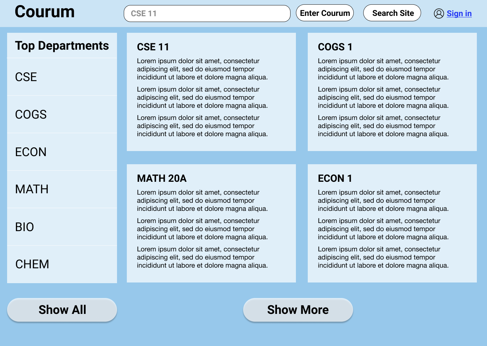
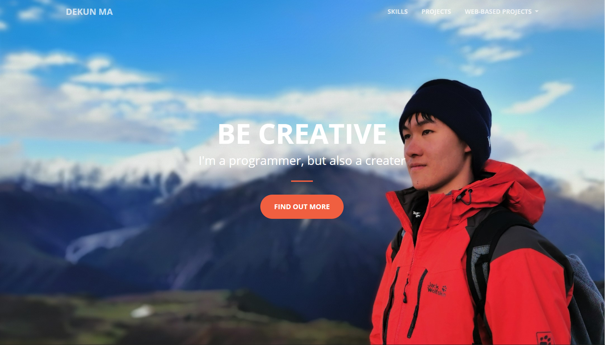
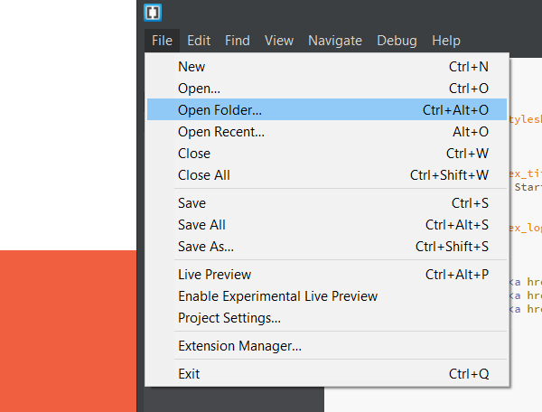
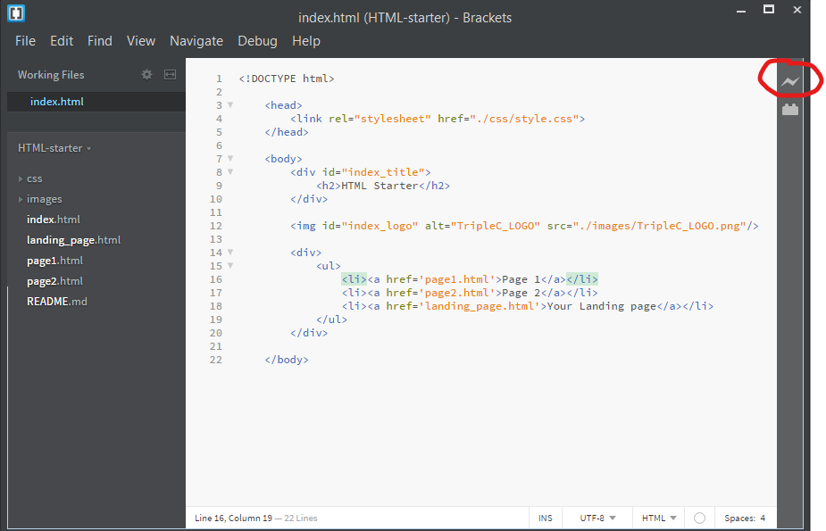
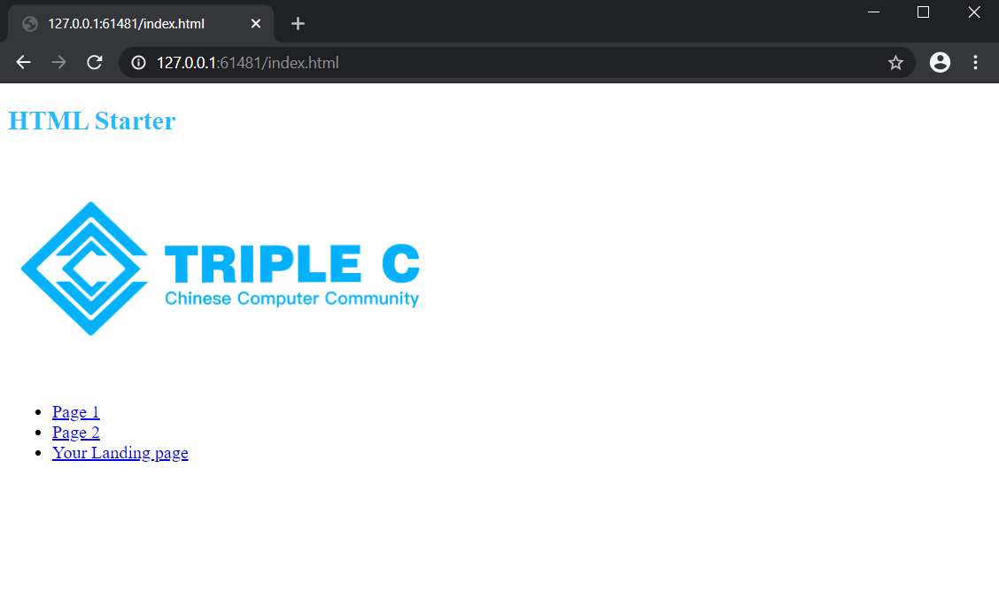
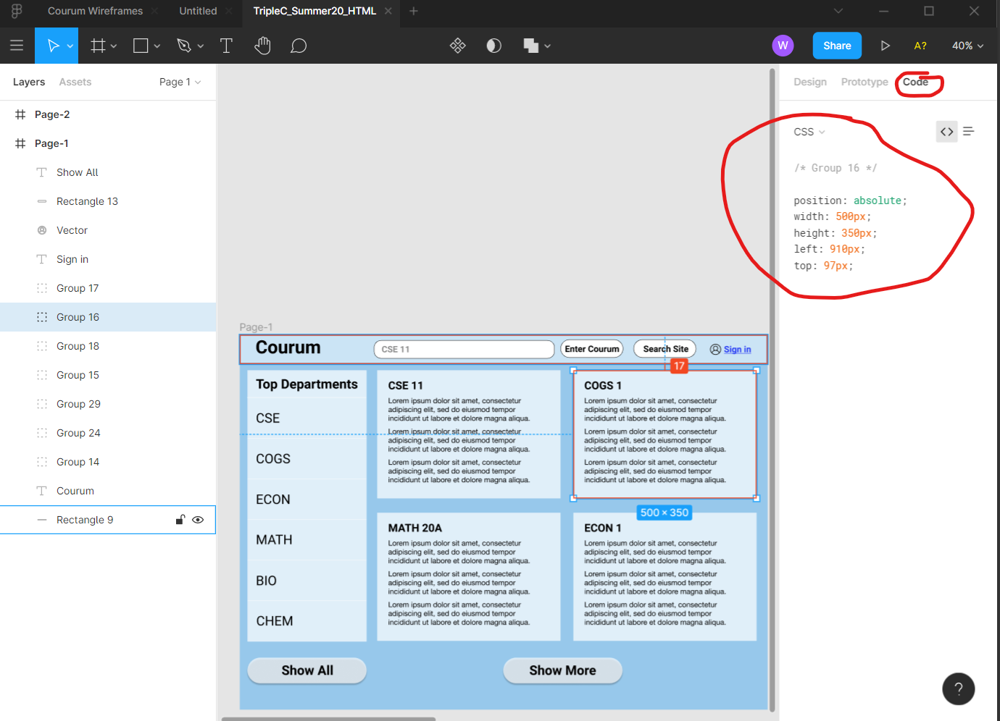
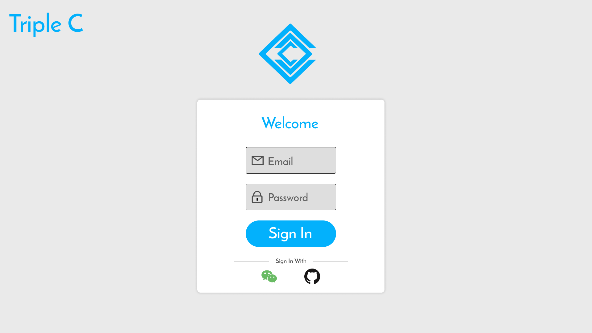

# Triple C 2020 Summer / Fall 选拔 Assignment: 静态网页

**Due date: 2020年8月31日 11:59 PM**  
我们会以due date之前你的最后一次commit作为参考标准

## 开始之前
虽然这是难度最低的项目，但这依然不是一个轻松的项目  
相信完成这个项目后你能学到很多网页开发的技能  
    
部分完成项目不代表失去选拔资格  
代码写了多少交多少就可以，我们会根据完成情况酌情考虑

## 项目简介：
在本次项目中，你将用HTML和CSS完成以下三个页面：  
- WireFrame页面
  
  
- 登录页面


- 你自己的个人简介页面，比如：


## Get Started
1. 安装[Brackets](http://brackets.io/)  
2. clone或download这个repo到本地
3. 测试Brackets能否正常使用：  
   打开Brackets后，左上角选择```open folder```，然后打开你下载下来的```HTML-starter```这个folder  
     
   folder打开之后，点击右边的这个小闪电  
     
   现在你的浏览器应该会自动打开一个窗口，显示文件夹中的```index.html```页面
   

## 学习HTML和CSS
- **记得HTML和CSS都要学**
- [W3Schools](https://www.w3schools.com/html/default.asp)
- B站和Youtube上面随便搜一搜，多得很

这些教程仅供参考  
可以自己再去找其他资源学习


## 具体说明：Page-1-WireFrame
在此处查看WireFrame[设计图](https://www.figma.com/file/x2din21LcGqaP7zYyShSzN/TripleC_Summer20_HTML?node-id=0%3A1)  
打开Figma页面之后，点击某一个部件，然后点击右边的```code```就能看到对应的CSS代码实现  
部件的大小（长宽）请根据你的屏幕尺寸做出自适应  
  
**注意**: 这里的CSS代码是自动生成的，直接全部复制粘贴过去一定无法达到你想要的效果

### 细节说明
- 你写的页面只需要跟Figma上的设计图**长得一样**，不需要在意功能  
- 页面需要**占满**你的屏幕，而不是在屏幕中画一个框框，然后在里面实现页面
- 上面含有```CSE11```的那个框框是个输入框，要可以输入文字  
- 输入框右边的两个是```button```，点击之后不需要发生任何事件
- 再往右的sign in是```link```，点击之后任意跳转到哪都行
- 左边```Top Departments```那一竖条是一个```unordered list```
- 最下面```Show All```和```Show More```是```button```，点击之后不需要发生任何事件

## 具体说明：Page-2-Sign In
在此处查看Sign In Page的[设计图](https://www.figma.com/file/x2din21LcGqaP7zYyShSzN/TripleC_Summer20_HTML?node-id=0%3A1) 
 

### 细节说明
- 你写的页面只需要跟Figma上的设计图**长得一样**，不需要在意功能  
- 页面需要**占满**你的屏幕，而不是在屏幕中画一个框框，然后在里面实现页面
- ```Email```和```PassWord```是两个输入框。输入时光标的起始位置在Email和Password的icon右边
- 下面的```Sign In```是```button```，点击之后不需要发生任何事件
- 点击左上角的```Triple C```之后需要跳转到```https://ucsdtriplec.org```
- 最下面```WeChat```和```Github```是两个icon，要求点击之后可以跳转到某一个你自己指定的网页
- 所有部件应像设计图中一样，保持视觉上的居中和平衡

## 具体说明：个人简介页面
我们对这个页面**没有任何具体要求**  
用你在前两个页面里学到的技能做一个自己的个人介绍页面就可以  
  
实在不知道做什么可以参考 [www.dekun.me](https://www.dekun.me) (一年多没更新了)

## TODO：
完成上面提到的三个页面

## 其他说明
1. 所有页面请尽可能与[设计图](https://www.figma.com/file/x2din21LcGqaP7zYyShSzN/TripleC_Summer20_HTML?node-id=0%3A1)中的长得一样，不用在意功能  
2. 可以使用包括但不限于```BootStrap```, ```semantic ui```的任意UI库来完成


## 项目完成之后
请将代码上传至自己github的repo，并将repo链接发至 ```William@dekun.me```  
我们会在完成对你代码的简单评估之后，针对你做的项目，对你进行面试

## 其他任何问题
请随时写邮件至 ```William@dekun.me``` 提问
   