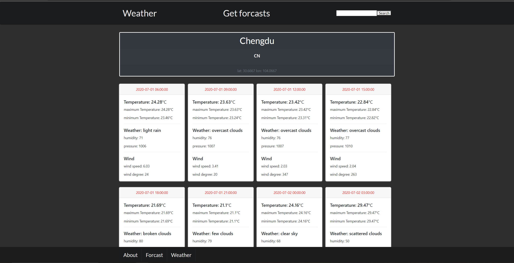

# Triple C 2020 Summer / Fall 选拔 Assignment: React.js

**Due date: 2020年8月16日 11:59 PM (你的当地时间)**  
我们会以due date之前你的最后一次commit作为参考标准

**Check point: 2020年7月26日11:59PM (你的当地时间)**  
我们会在check point检查一次你的进度  
不用紧张，这只是为了防止你在check point的时候还什么都没开始做  
不管进度如何，只要你开始着手做/学习了项目，则不会对你本次评估造成任何影响

## 开始之前

在开始之前，请确保你对以下知识有一定了解：
- HTML
- CSS
- JavaScript
- Http Request  
- 什么是API
- 什么是JSON  
- npm (会最基础的使用方法即可)

如果上述条目中有任意一个完全不知道，请先自学，或移步
 [静态网页 (HTML+CSS)](https://github.com/dekunma/TripleC_20Summer_PreAssignments/tree/master/HTML-starter)  

这不是一个轻松的项目，我们也不expect你能在两个月内完整完成这个项目  
部分完成项目不代表失去选拔资格  
代码写了多少交多少就可以，我们会根据完成情况酌情考虑


## 项目简介：
在本次项目中，你将用React，调用 openweathermap.org 的 API, 来完成一个天气预报的网站  
Example请参考 [weather.ucsdtriplec.org](https://weather.ucsdtriplec.org)  （你做的不需要长得跟这个网站完全一样）
  

## Get Started
1. clone或download这个repo到本地

2. 安装[node.js](https://nodejs.org/)（会自动安装npm）
3. ```cd```进入```weather-app-starter```这个文件夹
4. shell / terminal执行 ```npm install```  
5. 成功后，执行```npm start```，然后访问```http://localhost:3000```，你应该能看到一个网页的雏形
6. 学习React，然后根据后面提到的要求补全代码

## 学习React
- [先读一读官方doc](https://reactjs.org/)
- [Youtube上的React教程](https://www.youtube.com/watch?v=QFaFIcGhPoM&list=PLC3y8-rFHvwgg3vaYJgHGnModB54rxOk3&index=1)
- [B站上的React教程](https://www.bilibili.com/video/BV184411x7F9?from=search&seid=15359853692736051755)

这些教程仅供参考  
可以自己再去找其他资源学习

## TODO：
1. 写```AboutScreen```，在页面里简单介绍这个项目。具体要求见```AboutScreen```顶上的注释

2. 完成```ForcastScreen```，要求与[weather.ucsdtriplec.org/forcast](https://weather.ucsdtriplec.org/forcast) 功能一致。在右上角搜索框输入城市的英文名并点击Search后，页面上的名字和国家会发生相应改变，且页面中生成40张卡片，每张卡片储存3个小时的天气数据。（API获取到的数据里直接就有后面120个小时的天气数据，已经放在了一个长度为40的array里，不需要自己手动来分）
3. 完成```WeatherScreen```，要求与[weather.ucsdtriplec.org/weather](https://weather.ucsdtriplec.org/weather)功能一致。在右上角输入城市英文名并点击Add后，页面上会添加一张Card，显示你添加的城市当前的天气数据。（Card不一定要是与```ForcastScreen```的Card是同一个Card，可以在```components```目录里新建另一种Card组件）

## 其他说明
1. 所有页面***不需要***与[示例页面](https://weather.ucsdtriplec.org)长得一样。只要功能一样即可。

2. 可以使用包括但不限于```BootStrap```, ```semantic ui```的任意UI库来完成
3. 建议开始之前认真研究一下调用api返回的数据，参考```openweathermap.org```的[官方文档](https://openweathermap.org/)
4. API获取每天有1000次的限制，如果在配置正确的情况下无法获取数据，可能是已经超过上限了。

## 项目完成之后  
请新建一个**private**的Github repo，将代码上传至此处，并邀请账号```dekunma```加入   
或直接将代码打包发至```William@dekun.me```  
我们会在完成对你代码的简单评估之后，针对你做的项目，对你进行面试

## 其他任何问题
请随时写邮件至 ```William@dekun.me``` 提问
